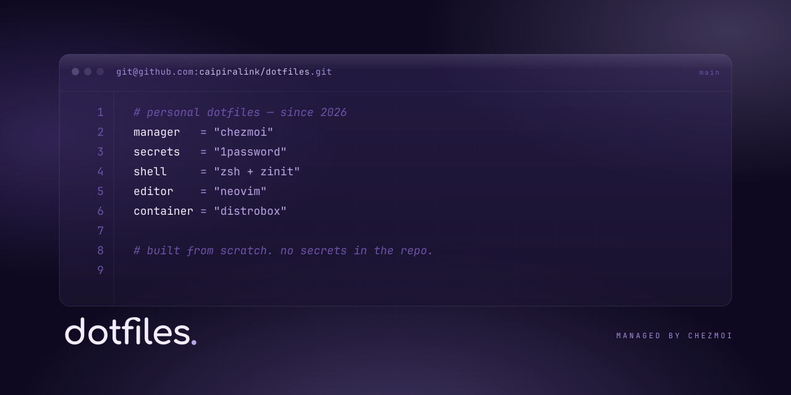

[](https://dotfiles.caipira.link/)

Personal dotfiles managed with [chezmoi](https://www.chezmoi.io/).

Built from scratch — I prefer configs I actually understand over copying large setups I can't maintain. Work in progress.

Uses 1Password for SSH keys and Git signing — no secrets stored in the repo.

## Setup

Some values (Git identity, 1Password vault references, APT mirror, etc.) are hardcoded for my environment. Fork and adjust before using.

```bash
chezmoi init --apply caipiralink/dotfiles
```

Chezmoi will ask whether this is a personal or work machine and configure Git identity accordingly.

## Contents

| Config | Target | Description |
|---|---|---|
| [`dot_zshrc`](dot_zshrc) | `~/.zshrc` | Zsh with [Zinit](https://github.com/zdharma-continuum/zinit) — completions, autosuggestions, syntax highlighting. `eza` aliases, sccache env vars, lazy tool activation (mise, starship, fzf, uv/uvx, kubectl, helm, gcloud). |
| [`powershell/`](private_dot_config/powershell/) | `~/.config/powershell/` | PowerShell 7 profile — PSReadLine, `eza` aliases, mise/starship/kubectl/helm activation, fzf keybindings. Distributed to PS 5 and PS 7 profile paths by a chezmoi script. |
| [`shell/env.zsh.tmpl`](private_dot_config/shell/env.zsh.tmpl) / [`powershell/env.ps1.tmpl`](private_dot_config/powershell/env.ps1.tmpl) | `~/.config/shell/env.zsh` / `~/.config/powershell/env.ps1` | Session environment variables rendered from the selected 1Password profile's `shell_env_json`. |
| [`starship.toml`](private_dot_config/starship.toml) | `~/.config/starship.toml` | Minimal — only overrides Node.js detection to `package.json` / `.node-version` / `node_modules`. |
| [`dot_gitconfig.tmpl`](dot_gitconfig.tmpl) | `~/.gitconfig` | SSH commit signing via 1Password. Personal/work identity templated by chezmoi. Signing program path adapts to OS. |
| [`nvim/`](private_dot_config/nvim/) | `~/.config/nvim/` | Single-file Neovim config with lazy.nvim. [→ details](private_dot_config/nvim/README.md) |
| [`mise/`](private_dot_config/mise/) | `~/.config/mise/` | 30+ dev tools managed by mise. [→ full list](private_dot_config/mise/README.md) |
| [`distrobox/`](private_dot_config/distrobox/) | `~/.config/distrobox/` | Debian Trixie dev container provisioning. [→ details](private_dot_config/distrobox/README.md) |
| [`1Password/`](private_dot_config/1Password/) | `~/.config/1Password/ssh/` | SSH agent vault selection (Linux/macOS) — personal: `SSH agent` only, work: adds `Work` vault. |
| [`AppData/Local/1Password/`](AppData/Local/1Password/) | `%LOCALAPPDATA%\1Password\config\ssh\` | Same SSH agent vault selection on Windows. |
| [`dot_local/private_bin/`](dot_local/private_bin/) | `~/.local/bin/` | Convenience symlinks — e.g. `dev` → `~/.config/distrobox/dev`. |

## chezmoi scripts

| Script | Purpose |
|---|---|
| [`run_once_windows_env.ps1.tmpl`](run_once_windows_env.ps1.tmpl) | One-time Windows user env setup: `XDG_CONFIG_HOME`, sccache (`RUSTC_WRAPPER`, `CMAKE_{C,CXX}_COMPILER_LAUNCHER`, `SCCACHE_DIR`), and appending the VS Build Tools LLVM `bin` (arch-aware) to `PATH`. |
| [`run_onchange_windows_shell_env.ps1.tmpl`](run_onchange_windows_shell_env.ps1.tmpl) | Syncs `shell_env_json` into Windows User environment variables for GUI apps and broadcasts an environment change notification. |
| [`run_onchange_windows_profile.ps1.tmpl`](run_onchange_windows_profile.ps1.tmpl) | Copies the managed PowerShell profile to both `Documents\PowerShell\` (PS 7) and `Documents\WindowsPowerShell\` (PS 5). |

## License

[Unlicense](LICENSE)
